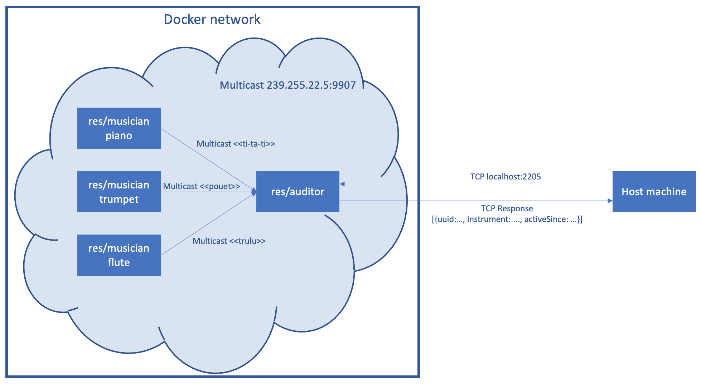

#  Teaching-HEIGVD-RES-2020-Labo-Orchestra

## Admin

* **You can work in groups of 2 students**.
* It is up to you if you want to fork this repo, or if you prefer to work in a private repo. However, you have to **use exactly the same directory structure for the validation procedure to work**. 
* We expect that you will have more issues and questions than with other labs (because we have a left some questions open on purpose). Please ask your questions on Telegram / Teams, so that everyone in the class can benefit from the discussion.

## Objectives

This lab has 4 objectives:

* The first objective is to **design and implement a simple application protocol on top of UDP**. It will be very similar to the protocol presented during the lecture (where thermometers were publishing temperature events in a multicast group and where a station was listening for these events).

* The second objective is to get familiar with several tools from **the JavaScript ecosystem**. You will implement two simple **Node.js** applications. You will also have to search for and use a couple of **npm modules** (i.e. third-party libraries).

* The third objective is to continue practicing with **Docker**. You will have to create 2 Docker images (they will be very similar to the images presented in class). You will then have to run multiple containers based on these images.

* Last but not least, the fourth objective is to **work with a bit less upfront guidance**, as compared with previous labs. This time, we do not provide a complete webcast to get you started, because we want you to search for information (this is a very important skill that we will increasingly train). Don't worry, we have prepared a fairly detailed list of tasks that will put you on the right track. If you feel a bit overwhelmed at the beginning, make sure to read this document carefully and to find answers to the questions asked in the tables. You will see that the whole thing will become more and more approachable.


## Requirements

In this lab, you will **write 2 small NodeJS applications** and **package them in Docker images**:

* the first app, **Musician**, simulates someone who plays an instrument in an orchestra. When the app is started, it is assigned an instrument (piano, flute, etc.). As long as it is running, every second it will emit a sound (well... simulate the emission of a sound: we are talking about a communication protocol). Of course, the sound depends on the instrument.

* the second app, **Auditor**, simulates someone who listens to the orchestra. This application has two responsibilities. Firstly, it must listen to Musicians and keep track of **active** musicians. A musician is active if it has played a sound during the last 5 seconds. Secondly, it must make this information available to you. Concretely, this means that it should implement a very simple TCP-based protocol.


### Instruments and sounds

The following table gives you the mapping between instruments and sounds. Please **use exactly the same string values** in your code, so that validation procedures can work.

| Instrument | Sound         |
|------------|---------------|
| `piano`    | `ti-ta-ti`    |
| `trumpet`  | `pouet`       |
| `flute`    | `trulu`       |
| `violin`   | `gzi-gzi`     |
| `drum`     | `boum-boum`   |

### TCP-based protocol to be implemented by the Auditor application

* The auditor should include a TCP server and accept connection requests on port 2205.
* After accepting a connection request, the auditor must send a JSON payload containing the list of <u>active</u> musicians, with the following format (it can be a single line, without indentation):

```
[
  {
  	"uuid" : "aa7d8cb3-a15f-4f06-a0eb-b8feb6244a60",
  	"instrument" : "piano",
  	"activeSince" : "2016-04-27T05:20:50.731Z"
  },
  {
  	"uuid" : "06dbcbeb-c4c8-49ed-ac2a-cd8716cbf2d3",
  	"instrument" : "flute",
  	"activeSince" : "2016-04-27T05:39:03.211Z"
  }
]
```

### What you should be able to do at the end of the lab


You should be able to start an **Auditor** container with the following command:

```
$ docker run -d -p 2205:2205 res/auditor
```

You should be able to connect to your **Auditor** container over TCP and see that there is no active musician.

```
$ telnet IP_ADDRESS_THAT_DEPENDS_ON_YOUR_SETUP 2205
[]
```

You should then be able to start a first **Musician** container with the following command:

```
$ docker run -d res/musician piano
```

After this, you should be able to verify two points. Firstly, if you connect to the TCP interface of your **Auditor** container, you should see that there is now one active musician (you should receive a JSON array with a single element). Secondly, you should be able to use `tcpdump` to monitor the UDP datagrams generated by the **Musician** container.

You should then be able to kill the **Musician** container, wait 5 seconds and connect to the TCP interface of the **Auditor** container. You should see that there is now no active musician (empty array).

You should then be able to start several **Musician** containers with the following commands:

```
$ docker run -d res/musician piano
$ docker run -d res/musician flute
$ docker run -d res/musician flute
$ docker run -d res/musician drum
```
When you connect to the TCP interface of the **Auditor**, you should receive an array of musicians that corresponds to your commands. You should also use `tcpdump` to monitor the UDP trafic in your system.


## Task 1: design the application architecture and protocols

| #  | Topic |
| --- | --- |
|Question | How can we represent the system in an **architecture diagram**, which gives information both about the Docker containers, the communication protocols and the commands? |
| |  |
|Question | Who is going to **send UDP datagrams** and **when**? |
| | Les containers musiciens vont envoyer leur uuid et le son de leur instrument toutes les secondes sur l'adresse multicast 239.255.22.5 |
|Question | Who is going to **listen for UDP datagrams** and what should happen when a datagram is received? |
| | L'auditeur va s'enregistres sur l'adrese multicast 239.255.22.5 et va écouter les datagrammes entrants |
|Question | What **payload** should we put in the UDP datagrams? |
| | L'uuid généré par le musicien à sa création et le son produit par son instrument |
|Question | What **data structures** do we need in the UDP sender and receiver? When will we update these data structures? When will we query these data structures? |
| | Les émetteurs (musiciens) envoient des données au format JSON, qui peuvent être parsées facilement par le récepteur (auditeur) qui va interpréter l'instrument en fonction du son reçu et créer un profil de musicien stocké dans une liste de musiciens. Si l'uuid reçu par l'auditeur existe déjà dans la liste de musiciens, alors l'auditeur va simplement mettre à jour la valeur du champ "activeSince" qui indique la dernière fois que le son de ce musicien a été entendu. |


## Task 2: implement a "musician" Node.js application

| #  | Topic |
| ---  | --- |
|Question | In a JavaScript program, if we have an object, how can we **serialize it in JSON**? |
| | L'objet JSON permet interagir avec les objets javascript. La fonction JSON.stringify() transforme un objet javascript en objet string contenant l'objet sous forme JSON. La fonction JSON.parse() fait l'inverse et transforme un objet String contenant le JSON en objet javascript. |
|Question | What is **npm**?  |
| | NPM est le Node Package Manager, c'est l'outil qui permet de gérer les packets et dépendances de NodeJS. Les dépendances sont indiquées dans le fichier package.json, de façon similaire au fichier pom.xml de l'outil Maven en Java. |
|Question | What is the `npm install` command and what is the purpose of the `--save` flag?  |
| | La commande npm install va télécharger toutes les dépendances indiquées dans le fichier package.json dans un dossier node-modules. Cela permet ensuite d'utiliser ces dépendances dans le projet NodeJS. Le flag --save permet de sauvegarder les dépendences installées dans le fichier package.json lorsqu'un package est spécifié (`npm install <nomdupackage> --save`). |
|Question | How can we use the `https://www.npmjs.com/` web site?  |
| | Ce site est une bibliothèpque de packages pouvant être installés dans un projet NodeJS. C'est l'équivalent du maven repository pour Java. Pour installer un packet il suffit de le rechercher puis de lancer la commande `npm install <nomdupackage> --save` dans le dossier du projet. |
|Question | In JavaScript, how can we **generate a UUID** compliant with RFC4122? |
| | On peut utiliser le package uuid disponible à l'adresse https://www.npmjs.com/package/uuid. Ce package peut être installé via la commande `npm install uuid --save` |
|Question | In Node.js, how can we execute a function on a **periodic** basis? |
| | Il est possible d'utiliser `setInterval(functon(){}, timeout);` pour lancer la fonction toutes les n millisecondes. |
|Question | In Node.js, how can we **emit UDP datagrams**? |
| | En créant un socket avec `dgram.createsocket('udp4')`, il est possible d'envoyer un datagramme en appelant `send(message, debut, taille, port, adresseMulticast, fonction)` sur ce socket. |
|Question | In Node.js, how can we **access the command line arguments**? |
| | Grâce à l'objet process, il est possible de récupérer les arguments avec `process.argv[n]` |


## Task 3: package the "musician" app in a Docker image

| #  | Topic |
| ---  | --- |
|Question | How do we **define and build our own Docker image**?|
| | Il faut commencer par créer un fichier Dockerfile dans le dossier ou l'on veut build l'image. Il ne faut pas oublier d'ajouter les commandes `npm install` et `node /opt/app/auditor.js` ou encore la commande `COPY src /opt/app/` pour copier le contenu du dossier `src` dans le dossier `/opt/app/` de l'image. Il faut ensuite utiliser la commande `docker build -t res/musician .` dans le dossier ou se trouve le dockerfile pour build l'image qui pourra ensuite être lancée avec la commande `docker run -d --name pianist res/musician piano`. |
|Question | How can we use the `ENTRYPOINT` statement in our Dockerfile?  |
| | La commande `ENTRYPOINT ["node", "/opt/app/musician.js"]` permet d'exécuter la commande `node /opt/app/musician.js` dans un container à sa création. Cete commande va lancer le fichier `musician.js` avec NodeJS. |
|Question | After building our Docker image, how do we use it to **run containers**?  |
| | Avec la commande `docker run -d --name pianist res/musician piano` (on donne l'argument piano au programme NodeJS pour avoir un pianiste) |
|Question | How do we get the list of all **running containers**?  |
| | Avec `docker ps` |
|Question | How do we **stop/kill** one running container?  |
| | Obtenir le nom du container cible avec `docker ps`, puis le tuer avec `docker kill <nomContainer>` |
|Question | How can we check that our running containers are effectively sending UDP datagrams?  |
| | Lancer un container `res/musician` sans l'option `-d` afin d'obtenir les sorties console du programme dans le container. Il suffit de faire un log des datagrammes envoyés. Et pour vérifier qu'il sont bien envoyés, lancer un container `res/auditor` et lancer une connexion tcp dessus, les musiciens détectés devront alors être affichés dans le retour JSON. |


## Task 4: implement an "auditor" Node.js application

| #  | Topic |
| ---  | ---  |
|Question | With Node.js, how can we listen for UDP datagrams in a multicast group? |
| | Il faut utiliser la dépendance `dgram`. Il faut créer un socket avec la fonction `createSocket()`, puis sur ce socket, il faut utiliser la fonction `bind()` pour ajouter le socket sur l'écoute de l'adresse multicast et le port spécifié avec la fonction `addMembership()`. |
|Question | How can we use the `Map` built-in object introduced in ECMAScript 6 to implement a **dictionary**?  |
| | Un objet map peut être utilisé pour associer les instruments aux sons qu'ils produisent. Une `Map` est créée avec l'instruction `const myMap = new Map()` puis des éléments peuvent être ajoutés avec `myMap.set('piano', 'ti-ta-ti')`. |
|Question | How can we use the `Moment.js` npm module to help us with **date manipulations** and formatting?  |
| | Il faut l'ajouter aux dépendances avec `npm install moment --save`, puis dans le code on peut l'importer avec `const moment = require('moment')` pour finalement obtenir une date au format ISO avec `moment().toISOString()` |
|Question | When and how do we **get rid of inactive players**?  |
| | Chaque musicien possède un compteur incrémenté chaque seconde et il est mis à 0 lorsqu'un datagramme venant de ce musicien est reçu. Lorsque ce compteur arrive à 5, une fonction apellée par intervalles réguliers va supprimer le musicien associé car cela indiquera qu'il n'est plus actif. |
|Question | How do I implement a **simple TCP server** in Node.js?  |
| | Avec le module `net` il est possible de créer un serveur TCP avec la fonction `createServer()`. Une fonction de callback est créée et sera apelée à chaque connexion d'un client. On peut donc renvoyer le JSON des musiciens actifs dans cette fonction. |


## Task 5: package the "auditor" app in a Docker image

| #  | Topic |
| ---  | --- |
|Question | How do we validate that the whole system works, once we have built our Docker image? |
| | Manuellement, il faut créer plusieurs containers musiciens avec des instruments différents et un container auditor. Il faut ensuite se connecter en TCP a cet auditor. Un JSON contenant les musiciens en activité devrait être reçu. Supprimer ensutie un musicien et relancer une connexion TCP après 5 secondes. Le musicien supprimé ne devrait plus être dans la liste. Le script de validation du laboratoire peut aussi être utilisé pour vérifier que les tests passent. |


## Constraints

Please be careful to adhere to the specifications in this document, and in particular

* the Docker image names
* the names of instruments and their sounds
* the TCP PORT number

Also, we have prepared two directories, where you should place your two `Dockerfile` with their dependent files.

Have a look at the `validate.sh` script located in the top-level directory. This script automates part of the validation process for your implementation (it will gradually be expanded with additional operations and assertions). As soon as you start creating your Docker images (i.e. creating your Dockerfiles), you should try to run it.
